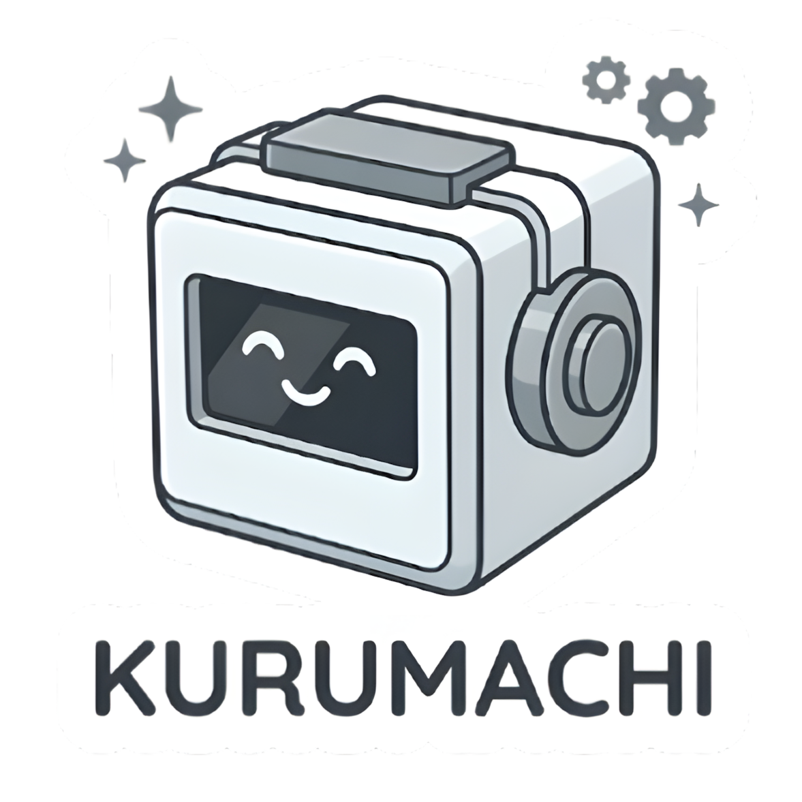

# 🤖 Kurumachi

A tiny ESP32-C3 powered car dashboard companion with sensors, animations, and a 3D printed body.

<p align="center">
  
</p>

---

## Features

- 🌡️ Temperature, humidity & pressure (AHT20 + BMP280)
- 📐 6-axis IMU with car tilt indicator (BMI160)
- 🔋 Battery voltage & percentage display
- 🎞️ 44 GIF animations with RLE compression on OLED
- 💤 Motion-triggered wake from light sleep
- 🔊 Startup beep
- 🖨️ Fully 3D printed enclosure (CAD files included)

---

## Hardware

| Component | Details |
|-----------|---------|
| MCU | ESP32-C3 Super Mini |
| Display | 1.3" OLED 128×64 SH1106 (I2C) |
| IMU | BMI160 6-axis (I2C) |
| Environment | AHT20 + BMP280 combo module (I2C) |
| Touch button | TTP223 capacitive |
| Charging | TP4057 Li-ion (Type-C) |
| Battery | 700mAh 3.7V LiPo |
| Buzzer | Passive |

### Pin Assignment

| Signal | GPIO |
|--------|------|
| SDA | 8 |
| SCL | 9 |
| TTP223 OUT | 4 |
| Buzzer | 1 |
| VBAT ADC | 3 |

### I2C Device Map

| Address | Device |
|---------|--------|
| 0x38 | AHT20 |
| 0x3C | OLED |
| 0x68 | BMI160 |
| 0x77 | BMP280 |

---

## Screens

| # | Screen | Description |
|---|--------|-------------|
| 0 | Animation | GIF animation playback (idle ↔ random) |
| 1 | Clock | Uptime HH:MM:SS + battery |
| 2 | IMU | Accel (m/s²) + Gyro (deg/s) |
| 3 | Environment | Temp / Humidity / Pressure |
| 4 | Tilt | Car roll & pitch indicator |

**Button gestures:**
- Single tap — next screen
- Double tap (on tilt screen) — set/reset zero calibration
- Hold — reserved

---

## Animation System

Screen 0 plays animations in alternating pattern: `sys_idle` → random → `sys_idle` → random → ...

Each full animation cycle triggers the switch. There are 44 animations total, stored as RLE-compressed C headers in `assets/animations/`.

### Animation list

| Category | Animations |
|----------|-----------|
| System | sys_idle, sys_scx |
| Eyes | eye_wink, eye_look_right, eye_look_left, eye_squint, eye_peek |
| Emotions | emotion_happy, emotion_smile, emotion_smirk, emotion_proud, emotion_love_01, emotion_love_02, emotion_uwu, emotion_relaxed, emotion_distracted, emotion_surprised, emotion_scared, emotion_frustrated, emotion_dizzy, emotion_angry_01, emotion_angry_03, emotion_angry_04, emotion_angry_fire, emotion_devil_02 |
| Actions | action_eat, action_yawn, action_sleepy, action_sneeze_01, action_sneeze_02, action_speed, action_pingpong, action_water_gun_01, action_water_gun_02 |
| Effects | effect_sakura, effect_rotate, effect_shrink |
| Themes | theme_bee, theme_dragon, theme_nose_fire |
| Other | Hello, cry, slayer, MD |

---

## Project Structure

```
kurumachi/
├── frimware/
│   └── kurumachi/
│       ├── src/
│       │   ├── main.cpp
│       │   ├── config.h
│       │   ├── bmi160.h
│       │   ├── battery.h
│       │   ├── buzzer.h
│       │   ├── sleep.h
│       │   ├── button.h
│       │   ├── bitmaps.h
│       │   ├── display.h
│       │   ├── animation.h       ← RLE animator engine
│       │   ├── animations_list.h ← all 44 AnimDef declarations
│       │   └── scenes.h
│       └── assets/
│           ├── animations/       ← RLE .h files (generated)
│           └── gifs/             ← source GIF files
├── cad/                          ← 3D printable enclosure files
├── tools/
│   └── gif2header.py             ← GIF → RLE C header converter
└── README.md
```

---

## Building the Firmware

### Requirements

- [PlatformIO](https://platformio.org/) (recommended) or Arduino IDE 2.x
- ESP32 Arduino core

### Libraries

```
olikraus/U8g2
adafruit/Adafruit AHTX0
adafruit/Adafruit BMP280 Library
adafruit/Adafruit BusIO
```

### platformio.ini

```ini
[env:esp32-c3-devkitm-1]
platform = espressif32
board = esp32-c3-devkitm-1
framework = arduino
board_build.mcu = esp32c3
board_build.f_cpu = 80000000L
board_upload.flash_size = 4MB
board_build.flash_size = 4MB
board_build.partitions = huge_app.csv
monitor_speed = 115200
monitor_filters = esp32_exception_decoder

lib_deps =
  olikraus/U8g2
  adafruit/Adafruit AHTX0
  adafruit/Adafruit BMP280 Library
  adafruit/Adafruit BusIO
```

### Flash

```bash
pio run --target upload
pio device monitor --baud 115200
```

> **Arch Linux:** Add yourself to the `uucp` group first:
> ```bash
> sudo usermod -aG uucp $USER
> ```

---

## GIF Converter

Converts GIF animations to RLE-compressed C headers for the OLED.

```bash
pip install Pillow
python tools/gif2header.py ./gifs ./assets/animations --invert
```

Options:

| Flag | Default | Description |
|------|---------|-------------|
| `--threshold` | 128 | Binarization threshold (0–255) |
| `--invert` | off | Invert black/white |
| `--scale` | fit | `fit` / `stretch` |
| `--width` | 128 | Output width in pixels |
| `--height` | 64 | Output height in pixels |

The script prints compression ratio for each file. Typical ratio is 3–8x for face animations.

Then regenerate `assets/animations/`, rebuild firmware.

---

## 3D Printing

CAD files are in the `/cad` folder.

- Printed in PLA
- No supports needed
- All parts snap/screw together

---

## Power

| Mode | Current |
|------|---------|
| Active (all on) | ~106 mA |
| Light sleep | ~0.85 mA |
| Estimated runtime (5 min active/hr) | ~3 days |

---

## License

MIT — do whatever you want, just keep the credits.

---

*Kurumachi says hi* 🤖
